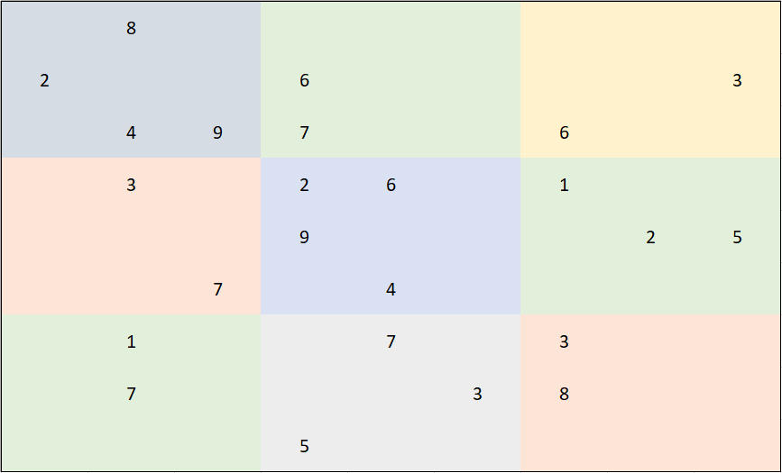
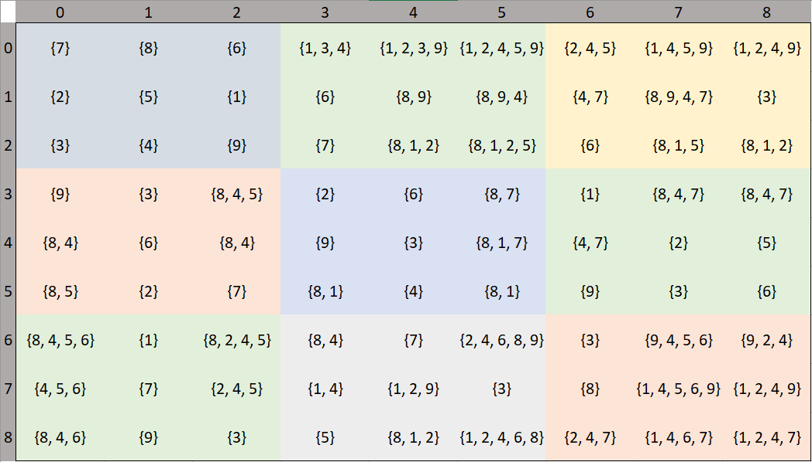
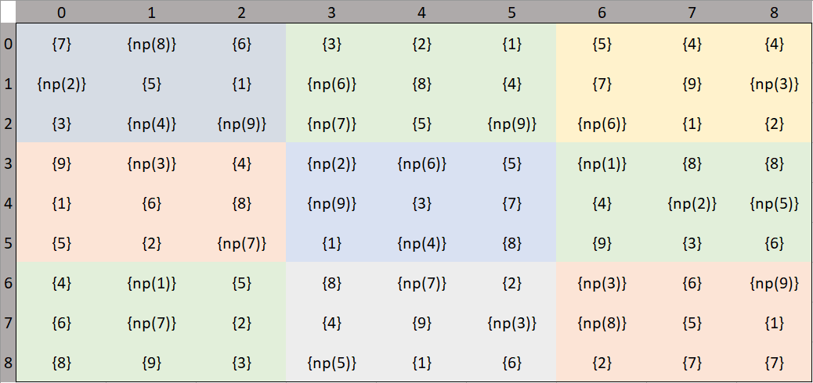

### 根據預置數據，在類似 9 宮格裏填數，橫和列中數值不能相同，小的子 9 宮格數值也不能相同，如下圖：



    =>



#### _procedure of the run:_

- 把預置 9 宮格中數據映射到 np3.py 的 numpy 數組中：
  ```python
  arr[0, 1, 0] = 8
  arr[1, 0, 0] = 2
  arr[1, 3, 0] = 6
  arr[1, 8, 0] = 3
  arr[2, 1, 0] = 4
  arr[2, 2, 0] = 9
  arr[2, 3, 0] = 7
  arr[2, 6, 0] = 6
  ...
  ```
- 運行 np3.py
- output in terminal:
  ```python
  [{7}, {np.float64(8.0)}, {6}, {1, 3, 4}, {1, 2, 3, 9}, {1, 2, 4, 5, 9}, {2, 4, 5}, {1, 4, 5, 9}, {1, 2, 4, 9}]
  [{np.float64(2.0)}, {5}, {1}, {np.float64(6.0)}, {8, 9}, {8, 9, 4}, {4, 7}, {8, 9, 4, 7}, {np.float64(3.0)}]
  [{3}, {np.float64(4.0)}, {np.float64(9.0)}, {np.float64(7.0)}, {8, 1, 2}, {8, 1, 2, 5}, {np.float64(6.0)}, {8, 1, 5}, {8, 1, 2}]
  [{9}, {np.float64(3.0)}, {8, 4, 5}, {np.float64(2.0)}, {np.float64(6.0)}, {8, 7}, {np.float64(1.0)}, {8, 4, 7}, {8, 4, 7}]
  [{8, 4}, {6}, {8, 4}, {np.float64(9.0)}, {3}, {8, 1, 7}, {4, 7}, {np.float64(2.0)}, {np.float64(5.0)}]
  [{8, 5}, {2}, {np.float64(7.0)}, {8, 1}, {np.float64(4.0)}, {8, 1}, {9}, {3}, {6}]
  [{8, 4, 5, 6}, {np.float64(1.0)}, {8, 2, 4, 5}, {8, 4}, {np.float64(7.0)}, {2, 4, 6, 8, 9}, {np.float64(3.0)}, {9, 4, 5, 6}, {9, 2, 4}]
  [{4, 5, 6}, {np.float64(7.0)}, {2, 4, 5}, {1, 4}, {1, 2, 9}, {np.float64(3.0)}, {np.float64(8.0)}, {1, 4, 5, 6, 9}, {1, 2, 4, 9}]
  [{8, 4, 6}, {9}, {3}, {np.float64(5.0)}, {8, 1, 2}, {1, 2, 4, 6, 8}, {2, 4, 7}, {1, 4, 6, 7}, {1, 2, 4, 7}]
  ```
- 根據生成結果，不斷在 np3.py 中添加或調整 numpy 數組的值，直到最後生成完整表格：
  ```python
  # append value based on the output, run for the final result
  arr[6, 8, 0] = 9
  arr[2, 5, 0] = 9
  ```
  如圖：
  
